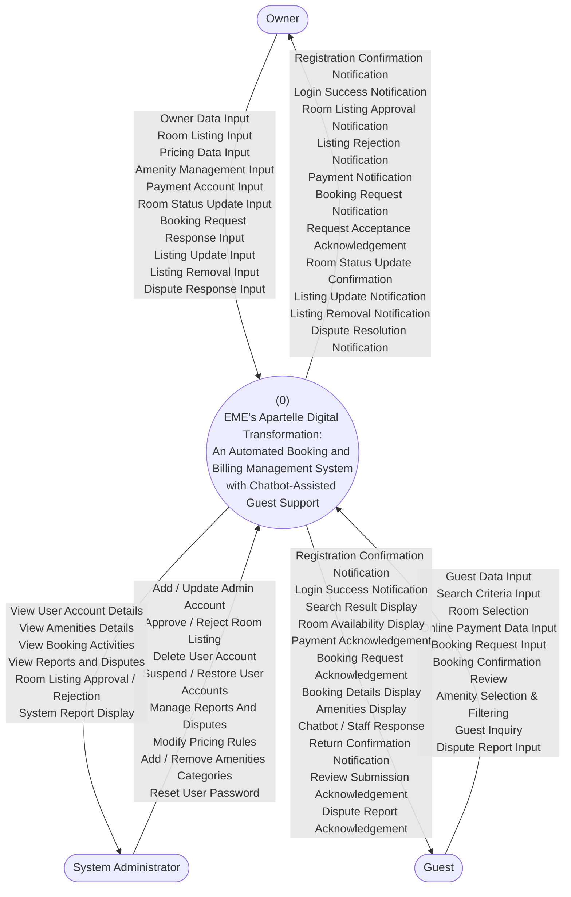

# Data Flow Diagram (DFD) - Context Diagram

This document presents the Context Diagram (Level 0 DFD) for the **EME’s Apartelle Digital Transformation** system, as verified against the research proposal and system requirements.

## DFD Overview

The diagram illustrates the high-level interactions between the central system and its three primary external entities: **Owner**, **System Administrator**, and **Guest**.

### Level 0: Context Diagram

## Verification Analysis

Based on the [Research Proposal](file:///c:/Users/basco/WebApp-EMEs-Apartelle/docs/research.md), the flow illustrated in the diagram is **CORRECT** and aligns with the following system requirements:

1.  **Process Identity**: The process name matches the official project title exactly.
2.  **Entity Roles**:
    *   **Owner**: Correctly handles establishment-side operations (Listings, Pricing, Disputes).
    *   **System Administrator**: Correctly handles platform-level management (User accounts, Global rules).
    *   **Guest**: Correctly handles the consumer journey (Search, Booking, Payment, Inquiry).
3.  **Chatbot Integration**: The inclusion of "Guest Inquiry" and "Chatbot / Staff Response" flows accurately reflects the "Chatbot-Assisted Guest Support" objective.
4.  **Dispute Management**: The diagram accounts for dispute reporting and resolution, which is essential for a comprehensive billing management system.
5.  **Amenities Filtering**: The "Amenity Selection & Filtering" input flow for Guests aligns with Objective 8 of the research paper.

## Conclusion
The DFD provided is an accurate representation of the system's functional scope and external interactions as defined in the project documentation.
